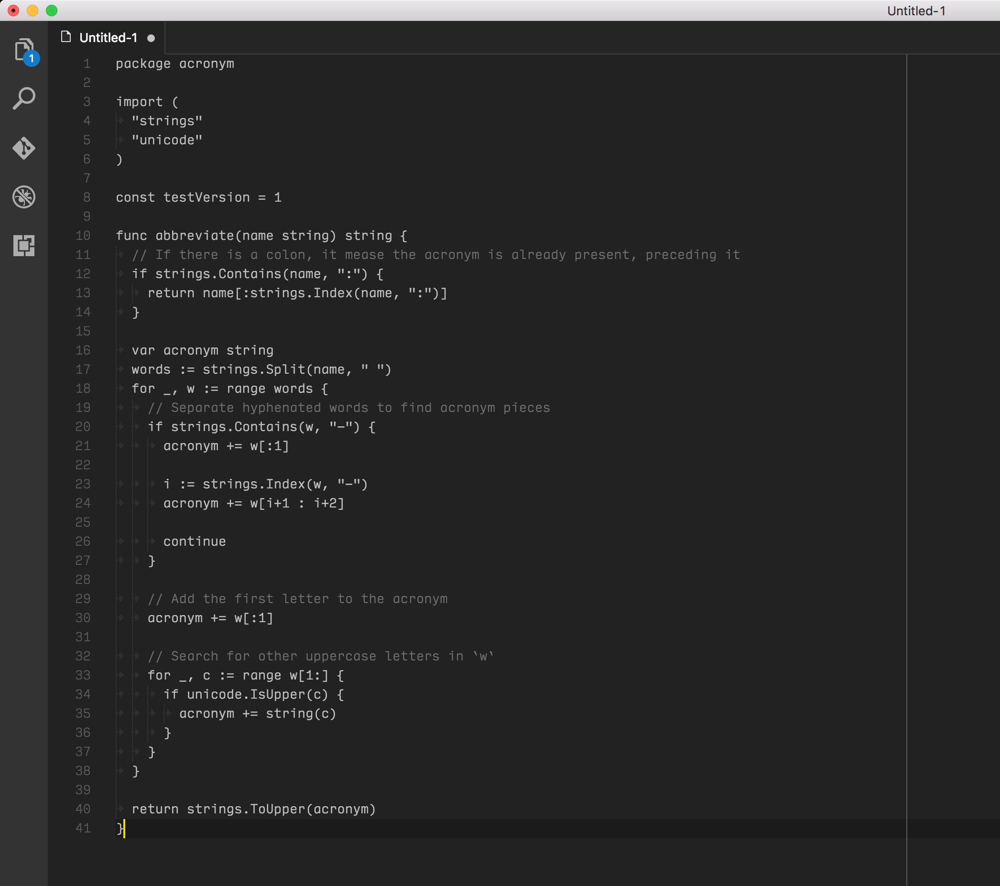

# Minimal Colors

A minimal syntax highlighting theme for [Visual Studio Code](http://code.visualstudio.com)

## Installation

1. Go to `View -> Extensions`
1. Search for `Minimal Colors`
1. Click the `Install` button
1. Click `Reload` if prompted

## Activate it

1. Go to `View -> Command Palette...`
1. Type `Preferences: Color Theme` and hit Enter
1. Choose the `Minimal Colors` theme

## License

[MIT License](./LICENSE)